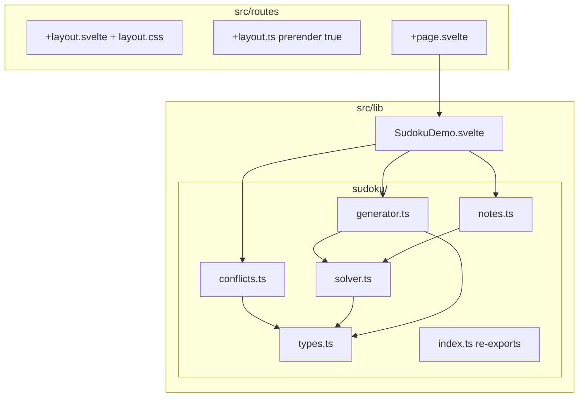

# Sudoku web app — architecture

This document describes how the app is structured today, how data flows through it, how it is built and deployed, and where the main technical limitations are (with practical directions to improve).

---

## 1. High-level view

The app is a **single-page, client-only** experience:

- **SvelteKit** is used for routing, layout, and the production build.
- **All gameplay runs in the browser**: puzzle generation, validation, notes, timer, and scoring.
- **Static hosting** (`@sveltejs/adapter-static`, full prerender) — there is **no server API** at runtime.

---

## 2. Directory and file structure

### 2.1 Routes (`src/routes/`)

| File | Role |
|------|------|
| `+layout.svelte` | Root layout: global CSS (`layout.css`), favicon link, `{@render children()}`. |
| `+layout.ts` | `export const prerender = true` — entire app is prerendered for static export. |
| `layout.css` | Tailwind v4 entry (`@import 'tailwindcss'`), base `body` / tap-highlight styles. |
| `+page.svelte` | Home page only: `<svelte:head>` meta + `<SudokuDemo />`. |

There are **no** dynamic routes, **no** `+server.ts`, and **no** load functions.

### 2.2 Game UI (`src/lib/components/`)

| File | Role |
|------|------|
| `SudokuDemo.svelte` | **Monolithic game shell**: all UI, local state, timer, undo stack, `localStorage` for monthly points, difficulty, and interactions. Imports engine functions from `$lib/sudoku/*`. |

### 2.3 Sudoku engine (`src/lib/sudoku/`)

| File | Exports / responsibilities |
|------|----------------------------|
| `types.ts` | `Difficulty`, `DIFFICULTY_TARGET_GIVENS`, `INDEX` helpers (`fromRC`, `row`, `col`). |
| `solver.ts` | `isValidPlacement`, `countSolutions` (mutable backtracking, early exit at `limit`), `fillGridRandom`, `generateCompleteGrid`. |
| `generator.ts` | `generatePuzzle(difficulty)`: full grid → dig cells while `countSolutions(...) === 1` → optionally add clues back to hit target givens per difficulty. Returns `{ solution, givens, values }`. |
| `conflicts.ts` | `computeConflictCells(values)`: marks cells involved in duplicate digits in row/column/box. |
| `notes.ts` | Bitmask pencil marks: `hasNote`, `toggleNote`, `pruneNotes` (uses `isValidPlacement`). |
| `index.ts` | Public barrel re-exports for consumers. |

### 2.4 Static assets

| Path | Role |
|------|------|
| `static/robots.txt` | Crawler hints. |
| `static/.nojekyll` | Disables Jekyll on GitHub Pages so `_app` assets are served. |
| `src/lib/assets/favicon.svg` | Favicon (imported in layout). |

### 2.5 Build and deploy config

| File | Role |
|------|------|
| `svelte.config.js` | `adapter-static` (`strict: true`), `paths.base` from env `BASE_PATH` (GitHub project pages). |
| `vite.config.ts` | `@tailwindcss/vite`, `sveltekit`. |
| `tsconfig.json` | TypeScript / SvelteKit paths. |
| `.github/workflows/deploy-github-pages.yml` | CI: `bun install`, `bun run build` with `BASE_PATH`, upload `build/`, deploy Pages. |

---

## 3. Function-level map (engine)

### `types.ts`

- **`INDEX.fromRC(row, col)`** → linear index `0..80`.
- **`INDEX.row(i)`**, **`INDEX.col(i)`** → row/column from linear index.

### `solver.ts`

- **`isValidPlacement(grid, index, digit)`** — Sudoku placement rules (row, column, 3×3 box), ignoring `index` when comparing.
- **`countSolutions(grid, limit)`** — DFS; mutates `grid` but restores before return; stops after `limit` solutions (default `2` for uniqueness checks).
- **`fillGridRandom(grid)`** — recursive fill with shuffled digit order (used to sample a random complete grid).
- **`generateCompleteGrid()`** — empty81 cells → `fillGridRandom` → completed grid.

### `generator.ts`

- **`shuffleIndices()`** — Fisher–Yates on `0..80`.
- **`countGivens(puzzle)`** — number of non-zero cells.
- **`generatePuzzle(difficulty)`** — see §4.2.

### `conflicts.ts`

- **`computeConflictCells(values)`** — for each filled cell, scan row/column/box for same value; sets boolean flags for clashing cells.

### `notes.ts`

- **`hasNote(mask, digit)`** — bit `(digit-1)` in `mask`.
- **`toggleNote(mask, digit)`** — XOR bit.
- **`pruneNotes(values, masks)`** — per empty cell, remove notes inconsistent with `values` via `isValidPlacement`.

---

## 4. Runtime behavior in `SudokuDemo.svelte`

### 4.1 State (Svelte 5 runes)

| State | Purpose |
|-------|---------|
| `difficulty` | `'easy' \| 'medium' \| 'hard'`. |
| `gameId` | Monotonic id per new puzzle; ties into “award points once per game”. |
| `givens` | `boolean[81]` — fixed clue cells. |
| `values` | `number[81]` — `0` empty, `1..9` filled. |
| `notes` | `number[81]` — bitmask pencil marks. |
| `notesMode` | Toggle: number pad edits notes vs values. |
| `selected` | Selected cell index or `null`. |
| `ready` | First puzzle loaded after `onMount` (avoids hydration mismatch / empty interaction). |
| `seconds` | Elapsed time while timer running. |
| `paused` | Pauses selection/timer (not full overlay). |
| `monthPoints` | Display of rolling “this month” score. |
| `pointsAwardedForGame` | Guards duplicate score grants for the same `gameId`. |
| `undoStack` | Snapshots `{ values, notes }` (capped at 80). |

Derived:

- **`conflicts`** — `computeConflictCells(values)`.
- **`solved`** — all cells filled and no conflicts (see §6.1).
- **`timerRunning`** — `ready && !paused && !solved`.
- **`dateLabel`**, **`timeLabel`** — header display.

### 4.2 Puzzle lifecycle

1. **`onMount`**: `monthPoints = loadMonthPoints()` (see UX doc for storage shape), **`startGame()`**, `ready = true`.
2. **`startGame()`**: `generatePuzzle(difficulty)` → assign `givens`, `values`; reset `notes`, `selected`, `undoStack`, `seconds`, `paused`, scoring guard. **`solution` from generator is not stored** in the component (hints were removed).
3. **Timer**: `$effect` subscribes to `timerRunning`; `setInterval` increments `seconds` every1s.
4. **Solve reward**: `$effect` when `solved && ready` and points not yet awarded for this `gameId` → `addMonthPoints(bonus)` with `bonus = max(500, 8000 - seconds*3)`.

### 4.3 User actions

| Action | Functions involved |
|--------|-------------------|
| Tap cell | `onCellTap` → `selected` (blocked if `paused`). |
| Tap digit | `applyDigit` → `pushUndo`, then value or `toggleNote` + `pruneNotes`. |
| Erase | `eraseSelection` → undo snapshot, clear notes or value. |
| Undo | `undo` → restore last snapshot. |
| Notes toggle | Flip `notesMode`. |
| Pause | Toggle `paused`. |
| New game / difficulty | `startGame()` (difficulty change also calls `startGame()`). |

### 4.4 Presentation helpers

- **`sameUnit`**, **`cellClass`** — peer highlighting (row/column/box) and conflict/selection styles.
- **`formatPoints`** — localized number string for header.

---

## 5. Build output and deployment

1. **`bun run build`** → Vite SSR build + prerender → **`adapter-static`** writes **`build/`** (HTML, `_app/`, copied `static/`).
2. **GitHub Actions** sets **`BASE_PATH`** to `/<repo>` for normal repos, or `''` for `owner.github.io` repo; **`svelte.config.js`** sets `kit.paths.base` so asset URLs resolve on Pages.
3. **No runtime Node server** — nginx/Pages serves static files only.

---

## 6. Limitations and improvement directions

### 6.1 Correctness / game design

- **Win condition** is “full grid + no conflicts”, not “matches the unique solution”. For a well-posed puzzle this is equivalent, but the UI does not verify uniqueness against a stored solution.
- **`solution` is discarded** after `generatePuzzle` in the UI layer — fine for no-hint play, but you cannot cheaply show “wrong number” vs “right number” without recomputation or storage.

### 6.2 Performance

- **Generator** calls **`countSolutions` many times** (each dig attempt copies the grid). Acceptable on desktop phones for 9×9, but **slow worst-case** on low-end devices; could add timeouts, Web Worker offload, or precomputed puzzle banks.
- **`computeConflictCells`** does redundant work (row/column/box scans overlap logically); could be optimized to O(81) with careful indexing or incremental updates on cell change.

### 6.3 Architecture / maintainability

- **`SudokuDemo.svelte` concentrates** UI + undo + game actions. Splitting into a small **`gameStore`** (or reducer module) and presentational subcomponents would improve reuse.
- Quality checks are **`bun run check`** (types + Svelte); there is no automated test suite.

### 6.4 Product / persistence

- **No save of in-progress puzzle** — refresh/new tab loses the current grid unless you add persistence (see UX doc).
- **Monthly score** is a single key; no per-device sync, no fraud resistance, no cross-browser identity.

### 6.5 Platform

- **Prerender + client-only game start** avoids SSR random mismatch; first paint still depends on **`onMount`** (brief “loading” state).
- **GitHub Pages** + static adapter: no cookies, no server sessions — all “memory” must be **client-side** (storage, PWA cache) or **external** (optional backend later).

---

## 7. Suggested enhancement backlog (technical)

| Priority | Item |
|----------|------|
| High | Persist **WIP game** (values, notes, givens, difficulty, optional puzzle seed) to `localStorage` or IndexedDB with schema version. |
| Medium | Optional **`stats` module** with typed keys if you reintroduce scoring or streaks. |
| Medium | Optional **Web Worker** for `generatePuzzle` to avoid main-thread jank. |
| Medium | Split **`SudokuDemo`** into layout sections + **`useGameState`** / store. |
| Low | Incremental conflict computation for smoother typing on very slow devices. |
| Low | Export **daily puzzle seed** in URL query for reproducibility and sharing. |

This file should stay aligned with the repo; update it when you add routes, adapters, or move logic out of `SudokuDemo.svelte`.
